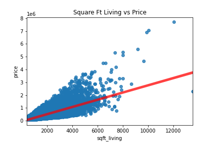

# Phase 2 Project

## Business Understanding

Our client is Genesis Capital's 'Fix & Flip' Division, a department within the real estate lending corporation in charge of lending to and participating in flipping houses. They are interested in the possibility of looking at the housing market in King County, Washington.

What is important to them, as a lender, is the pricing of the houses in King County. The features that affect price the most should be our goals for the model, as well as finding out the features to ignore and the features that negatively affect price.


### Business Problem
1. What features affect price the most?
2. What features should Genesis Capital pursue, ignore, or avoid?


## Data Understanding

Interpretation:
This data set is a record of house sales in King County, Washington, between 2014 and 2015. It includes information like the number of bedrooms, square footage (important!), condition, the year it was built, the year it was renovated (if applicable), and the zipcode and latitude/longitude. From this data, we can extrapolate location, age of the house, and size of the house, giving us a good look at how these factors affect the price.

Target: Price

Available Predictors: bedrooms, bathrooms, square footage of living space, square footage of the lot, numuber of floors, waterfront house or not, number of viewers, condition based on a numeric scale, grade based on a numeric scale, square footage of the basement, year the house was built, year the house was renovated, zipcode, latitude/longitude, and square footage of living space of the nearest 15 neighbors

## Data Preparation

Dataset: Entries of sales in King County contains over 21,597 entries form 2014 and 2015 with 21 different features including are target price. 
Some available predictors are: square footage of living space, number of floors, waterfront, and several others.

## Modeling

### First Simple Model



Square Foot Living was chosen for the First Simple Model due to its high correlation with housing price. 
We examine the relationship between these two we get an initial R-Squared in our model of 49.3%. 
Our coefficient is 280, meaning that within this simple linear regression, for each square foot that the house increases, the predicted price increases by $280.


### Feature Testing
Let start testing some features and see what we get. The first two features we are testing are categorical columns so we will need to use are dummy model function, and add them to are R-squared tracker.

### Feature Testing Results

Do the features effect the price in a significant way?

-Null: These features do not effect the price in a significant way?
Bathroom, Floors, Condition, and Grade(3-10)

-Alt: These features do effect the price in a significant way?
Bedrooms, Sqft Lot, Sqft Above, Sqft Basement, Sqft Living15, Sqft Lot15, Year_Built, Year Renovated, Waterfront, View, and Grade(11 - 13)

For the festures that do effect the price, which ones fit the model best?
Let use the features that have a R-squared equal to or greater than 0.500: Grade(11 -13), Bedrooms, Sqft Living15, Year Built, Waterfront, and View

## Conclusion

Overall, our final model had the following features:

Target: Price

Features: sqft_living, sqft_lot, bedrooms, waterfront, yr_built, and zipcode (as categoricals)

Adjusted R-Squared: 0.840

According to our final model, Genesis Capital needs to pay the most attention to whether or not the property is a waterfront property. Waterfront properties get a huge price boost in our model. Square foot living space, unsurprisingly, is another steady and significant coefficient. Bathrooms also significantly raise the price.

Negative coefficients include the number of bedrooms (surprisingly!), and as the year the house was built increases, there is actually a slight decrease in price. This could be due to extraneous factors such as modern housing being smaller and more space-efficient than older houses.

According to our model, Genesis Capital's team should pursue the following features when looking for houses:

1. A waterfront view
2. Many bathrooms
3. A large square footage of living space
4. Location in an expensive area

Conversely, they should avoid/ignore the following features: 

1. Ignore the number of floors
2. Avoide houses with many bedrooms
3. Examine the year it was built, but we are unsure if this is truly significant or if there are other factors at play

Finally, we isolated some of the most expensive zipcodes:

1. 98039 - Medina
2. 98004 - Bellevue
3. 98112 - Seattle

### Repo Structure
```
├── Code
│   ├── IMDB_data.ipynb
│   ├── New_IMDB_dataset.ipynb
│   ├── rt_data.ipynb
│   └── tn_cleaning.ipynb
|
├── Visualizations
│   ├── Actor_profitability.png
│   ├── Director_profitability.png
│   ├── Genre_profitability.png
│   ├── Genre_profitability_boxplot.png
│   ├── Keyword_Bubble.png
│   ├── Keyword_counts.png
│   ├── Keyword_revenue.png
│   ├── Production Budget vs. Gross Revenue Scatter.png
│   ├── RT_Tomatometer_ratings_box_correlation.PNG
│   ├── RT_ratings_box_correlation.png
│   └── production_gross_scatter.png
|
├── zippedData
├── .canvas
├── .gitignore
├── LICENSE.md
├── README.md
├── phase_1_presentation.pdf
└── technical_notebook.ipynb
```
